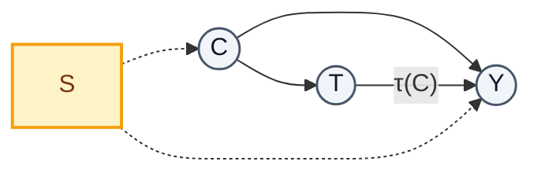

<h1 align="center">Causal Domain Adaptation</h1>

<p align="center">
  <b>Transporting the ATE across domains</b><br>
  <i>From Pearl &amp; Bareinboim's transportability theory to operational domain adaptation</i>
</p>

<p align="center">
  
  
  
  
</p>

<p align="center">
  <b>Elias Massaro</b> — Mines Nancy &amp; M2 MVA, ENS Paris-Saclay<br>
  Personally initiated research project, supervised by<br>
  <b>Prof. M. Clausel</b> (CRAN) and <b>Dr. A. Poinsot</b> (Lead of Research, Ekimetrics)
</p>

---

> [!NOTE]
> **Work in progress.** The report and the code are still being written; nothing is pushed yet.
> This README describes the target state of the repository.

## Objective

Domain adaptation (DA) asks how a predictor trained on a source domain behaves on a shifted
target domain. Causal transportability asks when a causal quantity estimated in a source
population remains valid in another. The two literatures answer neighbouring questions with
almost no shared vocabulary.

**The goal of this project is to turn the transportability framework of Bareinboim & Pearl (2013)
into an operational tool for domain adaptation** — i.e. to make the causal structure of a shift
say *which* DA correction is legitimate, instead of correcting blindly.

| # | Axis | Question | Deliverable |
|:-:|---|---|---|
| **1** | **Theory** | Which shifts leave a causal estimand invariant, and what does each one cost in target data? | Transport formulas + a *typed* refinement of selection diagrams |
| **2** | **Software** | Can a practitioner declare a causal diagram and get the right correction automatically? | A causal-structure layer for [**SKADA**](https://scikit-adaptation.github.io/), the open-source Python DA library |
| **3** | **Learning** | What if the diagram is unknown? | DA for structural causal models via a neural network estimating the underlying causal graph |

## Problem statement

Two branches must not be confused:

| | Object | Nature of the problem |
|---|---|---|
| **Statistical transportability** | $P^*(y \mid z)$ | estimable given target labels — a *statistical* problem (classical DA) |
| **Causal transportability** | $P^*(y \mid do(x))$ | in general **not identifiable even with infinite target data** — an *identification* problem |

Standard DA lives in the first branch; the 2013 Bareinboim–Pearl machinery (do-calculus,
$s$-hedge, sID) lives in the second. This project works on the bridge between them, with a
focus on transporting the **Average Treatment Effect (ATE)** under three data regimes.



<p align="center"><sub>Selection diagram. <b>S</b> marks <i>where</i> the two domains differ — and the
<i>absent</i> arrows are the ones carrying the information.</sub></p>

> [!IMPORTANT]
> Invariance of the estimand is not invariance of the statistic. Parameters can move the naive
> regression slope while leaving the ATE untouched — so a DA method calibrated on a marginal
> statistic may "correct" a shift that does not exist.

## Roadmap

- [x] Literature map: Pearl-school transportability vs. ML-school invariance vs. OT-based DA
- [x] Closed forms for the ATE and the confounding bias in a Gaussian SCM, Monte-Carlo validated
- [x] Taxonomy of shifts: which correction is legitimate for which perturbed parameter
- [ ] Typed selection diagrams (additive / modulator / off-effect arrows)
- [ ] Causal-structure layer for SKADA
- [ ] Graph estimation by neural network, and its effect on downstream transport
- [ ] Report

## Getting started

```bash
git clone https://github.com/eliasmassaro-hub/<repo>.git
cd <repo>
python -m venv .venv && source .venv/bin/activate
pip install -r requirements.txt
jupyter lab notebooks/ATE_Transport.ipynb
```

Python ≥ 3.10. Core dependencies: `numpy`, `scipy`, `pandas`, `statsmodels`, `networkx`
(d-separation checks), `matplotlib`, `skada`.

## References

**Causal transportability**

- Bareinboim & Pearl (2013). *A general algorithm for deciding transportability of experimental
  results.* Journal of Causal Inference.
- Jalaldoust & Bareinboim (2024). *Transportable Representations for Domain Generalization.* AAAI.
- Jalaldoust & Bareinboim (2025). *Partial Transportability.* arXiv:2503.23605.
- Subbaswamy, Schulam & Saria (2019). *Preventing failures due to dataset shift: learning
  predictive models that transport.* AISTATS. arXiv:1812.04597.
- Neal (2020). *Introduction to Causal Inference.*

**Causality → machine learning**

- Peters, Bühlmann & Meinshausen (2016). *Invariant causal prediction.* JRSS-B.
- Rojas-Carulla et al. (2018). *Invariant models for causal transfer learning.* JMLR.
- Magliacane et al. (2018). *Domain adaptation by using causal inference to predict invariant
  conditional distributions.* NeurIPS.
- Chen & Bühlmann (2021). *Domain adaptation under structural causal models.* JMLR.
- Zhao et al. (2019). *On learning invariant representations for domain adaptation.* ICML.

**Optimal-transport domain adaptation**

- Courty, Flamary, Habrard & Rakotomamonjy (2017). *Joint distribution optimal transportation
  for domain adaptation (JDOT).* NeurIPS.
- Damodaran et al. (2018). *DeepJDOT.* ECCV.
- Redko et al. (2020). *A survey on domain adaptation theory.* arXiv:2004.11829.
- Wang et al. (2021). *Generalizing to unseen domains: a survey on domain generalization.*
  arXiv:2103.02503.

---

<p align="center">
  <sub><b>Elias Massaro</b> ·
  <a href="https://github.com/eliasmassaro-hub">GitHub</a> ·
  <a href="https://linkedin.com/in/elias-massaro">LinkedIn</a></sub>
</p>
